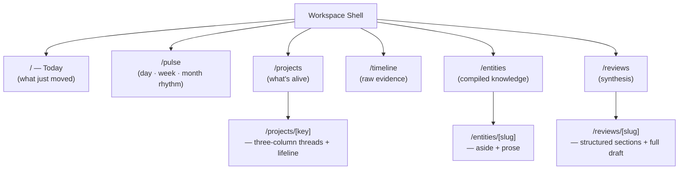
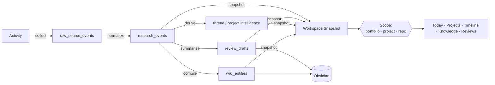
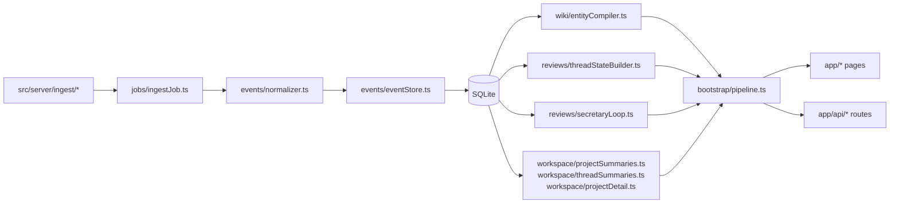

<div align="center">

# Waybook

**Local-first research workbench for AI-native work.**

*Collect fragmented activity from Claude, Codex, Git, and experiments → compile into a coherent research memory → read it like an editorial desk.*


</div>

---

## Why Waybook

Modern AI-native work produces a lot of output, but **weak continuity**.

You quickly forget:

- what actually changed yesterday,
- where an idea was already tested,
- which project consumed the last three days,
- whether a line of work has already stalled or repeated,
- what deserves promotion into long-term knowledge.

Waybook answers those five questions from real evidence, not from memory — and presents the answers on an editorial surface, not a dashboard.

## What it is — and isn't

| Waybook **is** | Waybook **is not** |
| --- | --- |
| a local-first research memory & synthesis workspace | a replacement for Claude Code / Codex |
| a compiler from research events → wiki-like entities | a generic second-brain or note-taking tool |
| a scope-aware lens (`portfolio` · `project` · `repo`) | a chat UI for raw transcripts |
| SQLite as source of truth, Obsidian as optional export | a cloud/team collaboration product |

---

## Design language

Waybook is styled to feel like a **well-edited research notebook**, not a control panel.

| Primitive | Role |
| --- | --- |
| **Serif masthead + lead** | every surface opens with one big title and one serif lead sentence — you always know *what this page is answering* |
| **Eyebrow + pill** | sections are marked with small caps eyebrows and low-chroma pills; no heavy cards |
| **Editorial prose** (`ProseView`) | managed markdown is rendered with real typographic hierarchy: h1/h2 rules, indented lists, accent blockquotes, inline code — never a raw `<pre>` dump |
| **Two-column detail layout** | detail pages put a narrow meta rail beside the body so project/status/evidence counts stay visible while you read |
| **Density lists** | indexes are divider-separated rows, each row one line of signal + one line of color — no cards with redundant fields |
| **One warm accent** | a single oxide-orange `--accent`, everything else on paper + stone; hairline rules replace boxes |

### Where each question lives



Each piece of content has exactly one home. Today doesn't duplicate Projects; Knowledge doesn't duplicate Projects; detail pages don't repeat their own eyebrow.

---

## Core architecture

```mermaid
flowchart TB
    subgraph S[Sources]
        S1[Claude CLI JSONL]
        S2[Codex rollout JSONL]
        S3[Git log]
        S4[Experiment filesystem]
        S5[claude-mem SQLite]
        S6[Seed fixtures]
    end

    subgraph I[Ingest Layer]
        I1[sourceRegistry]
        I2[ingestJob]
        I3[collectorCheckpoints]
    end

    subgraph N[Normalize &amp; Compile]
        N1[normalizer]
        N2[entityCompiler]
        N3[threadStateBuilder]
        N4[projectSummaries / threadSummaries / projectDetail]
    end

    subgraph R[Review &amp; Secretary]
        R1[digestEngine]
        R2[scopeDigestBuilder]
        R3[secretaryLoop]
        R4[reviewComposer]
    end

    subgraph DB[(SQLite — source of truth)]
        T1[raw_source_events]
        T2[research_events]
        T3[wiki_entities]
        T4[review_drafts]
        T5[collector_checkpoints]
    end

    subgraph W[Workspace]
        W1[Today]
        W2[Projects]
        W3[Project Detail]
        W4[Timeline]
        W5[Knowledge]
        W6[Reviews]
    end

    subgraph X[Sync]
        X1[Obsidian export]
    end

    S --> I --> T1
    T1 --> N1 --> T2
    T2 --> N2 --> T3
    T2 --> N3 --> N4
    T2 --> R1 --> R2 --> R3 --> R4 --> T4
    T2 --> W
    T3 --> W
    T4 --> W
    N4 --> W
    T3 --> X1
    T4 --> X1
```

**Four layers, one rule:** every page, review, or entity links back to concrete evidence rows in `research_events`.

---

## Functional flow



**Read path is passive.** Opening a page never triggers ingestion or review writes — snapshots are pure functions of current DB state.

---

## Data model

| Table | Purpose |
| --- | --- |
| `raw_source_events` | immutable captures from each connector invocation |
| `research_events` | normalized, product-facing events powering every view |
| `wiki_entities` | compiled durable knowledge (project / topic / experiment) |
| `review_drafts` | `daily-brief`, `daily-review`, `weekly-review` by scope |
| `collector_checkpoints` | idempotency cursors for incremental ingestion |

Three provenance tiers — `primary` · `derived` · `synthetic` — are preserved end-to-end so you can always tell what is real evidence vs. synthesized summary.

---

## Module map



---

## Capabilities

### Shipped

- **Ingestion** — Claude CLI, Codex rollout, Git log, experiment FS, `claude-mem`, plus seed fixtures
- **Normalization** — unified `research_events` with `actor_kind`, `tags`, `files`, `importance_score`
- **Compilation** — `wiki_entities` for project / topic / experiment surfaces
- **Intelligence** — active / stalled thread derivation, repeated-pattern hints, per-project detail
- **Secretary** — scope-aware `daily-brief`, `daily-review`, `weekly-review`
- **Workspace** — editorial Today / Pulse / Projects / Project Detail / Timeline / Knowledge / Reviews
- **Pulse surface** — `/pulse` stacks a daily list, weekly × project heatmap, and monthly arc cards, all passive rollups of the DB
- **Project lifeline** — every project detail ends in a vertical progress tree with first / peak / last anchors and linked entities
- **Scopes** — first-class `portfolio` · `project` · `repo` navigation
- **Sync** — Obsidian markdown export with stable paths and frontmatter
- **Typography** — `ProseView` (now with pipe tables and nested lists) + editorial primitives (`DetailPage`, `MetaList`, `Eyebrow`, `Pill`) so every detail page is readable, not a code dump
- **Sparkline** — importance-weighted daily series with accent dots marking high-gravity days

### Ahead

- Persisted `thread_states` tables (currently derived at read time)
- Dedicated thread-detail routes
- Richer entity types — `decision`, `method`, `artifact`
- Promotion flow (draft → review → durable wiki page)
- First-class Search surface
- Human override: rename / merge / mark-wrong

---

## Quick start

```bash
# 1. install
npm install

# 2. configure
cp .env.example .env
#   → edit .env and data/project-registry.json to match your machine

# 3. build the memory
npm run ingest            # collect + persist source events
npm run secretary         # generate daily / weekly drafts
npm run export:obsidian   # optional: write markdown export

# 4. open the workspace
npm run dev
```

Then visit <http://localhost:3000>.

---

## Scripts

| Script | What it does |
| --- | --- |
| `npm run dev` | start Next.js in development |
| `npm run build` | production build |
| `npm run start` | run production server |
| `npm test` | Vitest unit + integration suite (58 tests) |
| `npm run test:watch` | Vitest in watch mode |
| `npm run ingest` | run all collectors, persist raw + normalized events |
| `npm run secretary` | generate scope-aware review drafts |
| `npm run export:obsidian` | write compiled entities and reviews to markdown |

---

## Project structure

```
src/
├── app/                        # Next.js App Router pages + API routes
│   ├── page.tsx                #   / — Today (editorial front page)
│   ├── pulse/                  #   /pulse — day · week · month progress surface
│   ├── projects/               #   /projects, /projects/[projectKey] (+ lifeline)
│   ├── timeline/               #   /timeline
│   ├── entities/               #   /entities, /entities/[slug]
│   ├── reviews/                #   /reviews, /reviews/[slug]
│   └── api/                    #   JSON feeds: projects · timeline · reviews · entities · export
├── components/
│   ├── workspace/              # editorial primitives
│   │   ├── WorkspaceShell.tsx  #   top nav + language toggle
│   │   ├── WorkspacePage.tsx   #   list-page masthead + sections
│   │   ├── DetailPage.tsx      #   detail-page layout (aside + main)
│   │   ├── ProseView.tsx       #   markdown → typography (tables + nested lists, no external deps)
│   │   ├── chrome.tsx          #   Eyebrow · MetaList · Pill
│   │   └── formatting.ts       #   locale-aware date/time helpers
│   ├── viz/                    # StatusDot · Sparkline (importance-weighted) · Row
│   ├── projects/               # project/thread cards · ProgressTree (lifeline)
│   ├── entities/               # entity cards
│   ├── reviews/                # review-specific chrome (ScopeTabs, ReviewCard)
│   └── timeline/               # TimelineList
├── lib/                        # config, i18n, project registry, scope query
└── server/
    ├── db/                     # Drizzle schema + SQLite client
    ├── ingest/                 # collectors + source registry
    ├── events/                 # normalizer + event store
    ├── wiki/                   # entity compiler, store, renderer
    ├── reviews/                # digest engine, secretary loop, thread state
    ├── workspace/              # project/thread summaries, project detail,
    │                           # dailyPulse, weeklyHeatmap, monthlyArc, projectTree
    ├── search/                 # timeline + entity query services
    ├── jobs/                   # CLI entry points (ingest / secretary / export)
    └── bootstrap/              # pipeline.ts — workspace snapshot assembler

tests/                          # Vitest suites mirroring the src/ tree
data/                           # SQLite DB, project registry, runtime outputs
docs/                           # product spec, current architecture, phased plans
```

---

## Roadmap

| Phase | Scope | Status |
| --- | --- | --- |
| **M1** — Research memory backbone | schema, ingestion, normalization, entity compilation, baseline workspace | ✅ done |
| **M2** — Secretary loop | scope-aware digests, secretary outputs, Obsidian export | ✅ done |
| **Phase 1** — Workspace refresh | passive reads, scope tabs, unified shell | ✅ done |
| **Phase 2** — Project & thread intelligence | projects API, project detail, thread cards, repeated patterns | ✅ done |
| **Phase 2.5** — Editorial redesign | typography system, `ProseView`, detail-page layout, de-duplication | ✅ done |
| **Phase 3** — Progress surface | `/pulse` (daily · weekly · monthly) + per-project lifeline tree | ✅ done |
| **Phase 4** — Evidence → knowledge closure | richer entity types, promotion flow, search | 🔜 next |
| **Phase 5** — Live collectors hardening | replace seeded sources with production adapters | 🗓 planned |
| **Phase 6** — Persistence & scale | persisted thread states, split pipeline layer | 🗓 planned |

---

## Deploy

Waybook is **not serverless-ready.** It depends on a local SQLite file (`better-sqlite3`) and reads connector source trees from the filesystem, so platforms like Vercel or Netlify won't work out of the box.

Recommended targets:

| Target | Why |
| --- | --- |
| **Self-hosted Node / PM2** | closest to the development workflow; mount `data/` on persistent disk |
| **Docker + small VPS** (Fly.io, Hetzner, Railway) | `next build && next start` on Node 20+, volume mount `data/` |
| **Local-only** | for a single user, `npm run build && npm run start` on a home box is fine |

Minimum production checklist:

- Node.js **20+**
- Persistent volume for `data/waybook.db`
- Writable path for `WAYBOOK_EXPORT_ROOT`
- Periodic `npm run ingest && npm run secretary` (cron / systemd timer)

---

## Documentation

- [Product design spec](docs/superpowers/specs/2026-04-15-waybook-design.md)
- [Current architecture](docs/waybook-current-architecture.md)
- [M1 backbone plan](docs/superpowers/plans/2026-04-15-waybook-m1-research-memory-backbone.md)
- [M2 secretary loop plan](docs/superpowers/plans/2026-04-16-waybook-m2-secretary-loop.md)
- [Secretary scope implementation](docs/superpowers/plans/2026-04-16-waybook-secretary-scope-implementation.md)
- [Phase 2 project/thread intelligence](docs/superpowers/plans/2026-04-17-waybook-phase-2-project-thread-intelligence.md)
- [Current architecture snapshot](docs/waybook-current-architecture.md)

---

## Notes

- SQLite at `data/waybook.db` is authoritative. Obsidian is a *view*, not a store.
- Runtime outputs under `data/` are not source-controlled artifacts.
- `data/project-registry.json` is checked in as the default local project map.
- The read path is **passive** — no write-on-read side effects when you open a page.
