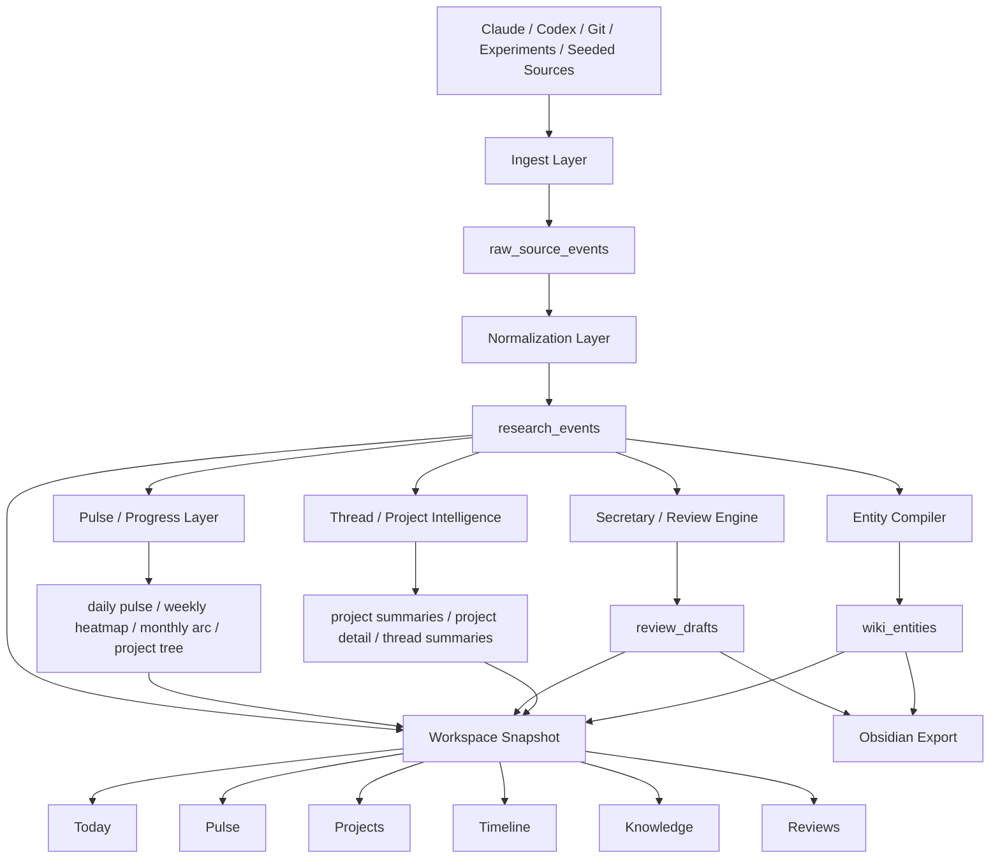
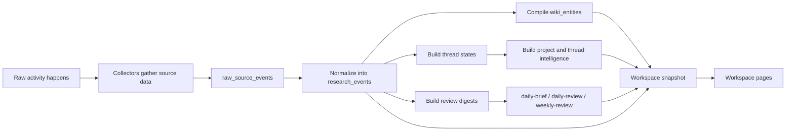

# Waybook Current Architecture

## What Waybook is now

Waybook is now a **local-first research workspace** for AI-native work. It collects fragmented activity from coding agents, repositories, and experiments, compiles that evidence into structured research data, and presents it through a workspace built around recovery, project visibility, and decision support.

The system is no longer just a memory viewer. Its current shape is:

- evidence ingestion
- event normalization
- knowledge compilation
- thread and project intelligence
- review generation
- workspace presentation

## Core product model

Waybook answers five questions:

1. What happened?
2. Where did it happen?
3. Which project or thread is active now?
4. Have I already tried this line of work?
5. What should be promoted into durable knowledge?

## System architecture



## Storage model

The SQLite database is the authoritative fact layer.

### Core tables

- `raw_source_events` — immutable source captures from connectors
- `research_events` — normalized events used by search, timeline, and intelligence layers
- `wiki_entities` — compiled durable knowledge surfaces
- `review_drafts` — generated daily / weekly review outputs
- `collector_checkpoints` — ingestion cursors for idempotent collection

## Functional flow



## Runtime layers

### 1. Ingest layer

Responsible for collecting source data and preserving it.

Main files:
- `src/server/ingest/sourceRegistry.ts`
- `src/server/jobs/ingestJob.ts`

Responsibilities:
- run collectors
- persist raw source events
- update collector checkpoints
- feed normalization

### 2. Normalize and compile layer

Responsible for turning raw captures into product-facing structures.

Main files:
- `src/server/events/normalizer.ts`
- `src/server/wiki/entityCompiler.ts`
- `src/server/reviews/threadStateBuilder.ts`
- `src/server/workspace/projectSummaries.ts`
- `src/server/workspace/threadSummaries.ts`
- `src/server/workspace/projectDetail.ts`
- `src/server/workspace/dailyPulse.ts`
- `src/server/workspace/weeklyHeatmap.ts`
- `src/server/workspace/monthlyArc.ts`
- `src/server/workspace/projectTree.ts`

Responsibilities:
- normalize raw events into `research_events`
- compile entities into `wiki_entities`
- derive thread states
- derive project summaries
- derive project detail intelligence
- derive passive progress views (daily pulse, weekly heatmap, monthly arc, per-project lifeline)

### 3. Review / secretary layer

Responsible for decision-support summaries rather than raw logging.

Main files:
- `src/server/reviews/secretaryLoop.ts`
- `src/server/reviews/scopeDigestBuilder.ts`
- `src/server/jobs/secretaryLoopJob.ts`

Responsibilities:
- build scoped review contexts
- produce `daily-brief`, `daily-review`, `weekly-review`
- keep secretary outputs linked to evidence

### 4. Workspace query layer

Responsible for assembling page-ready snapshots.

Main file:
- `src/server/bootstrap/pipeline.ts`

Responsibilities:
- read normalized events
- apply scope filters
- join entities, reviews, and project summaries
- expose one consistent snapshot to workspace pages

### 5. Presentation layer

Responsible for the workspace experience.

Main pages:
- `/` → Today
- `/pulse` → Pulse (day · week · month)
- `/projects` → Projects
- `/projects/[projectKey]` → Project Detail (+ project lifeline)
- `/timeline` → Timeline
- `/entities` → Knowledge
- `/reviews` → Reviews

Shared UI primitives:
- `src/components/workspace/WorkspaceShell.tsx`
- `src/components/workspace/WorkspacePage.tsx`
- `src/components/workspace/DetailPage.tsx`
- `src/components/workspace/ProseView.tsx` (tables + nested lists)
- `src/components/reviews/ScopeTabs.tsx`
- `src/components/projects/ProjectSummaryCard.tsx`
- `src/components/projects/ThreadSummaryCard.tsx`
- `src/components/projects/RepeatedPatternList.tsx`
- `src/components/projects/ProgressTree.tsx`
- `src/components/viz/Sparkline.tsx` (importance-weighted)

## Current page architecture

```mermaid
flowchart TD
    A[Workspace Shell] --> B[Today]
    A --> PU[Pulse]
    A --> C[Projects]
    A --> D[Timeline]
    A --> E[Knowledge]
    A --> F[Reviews]

    B --> B0[Needs Attention / Top Moves Today]
    B --> B1[Scope]
    B --> B2[Active Projects]
    B --> B3[Recent Evidence]
    B --> B4[Decision Support]

    PU --> PU1[Daily pulse list]
    PU --> PU2[Weekly heatmap]
    PU --> PU3[Monthly arc cards]

    C --> C1[Projects in Motion]
    C --> C2[Active Threads]
    C --> C3[Links to Project Detail]

    G[Project Detail] --> G1[Recent Evidence]
    G --> G2[Active Threads]
    G --> G3[Stalled Threads]
    G --> G4[Repeated Patterns]
    G --> G5[Project Lifeline — first / peak / last anchors]

    D --> D1[Active Filters]
    D --> D2[Research Activity]

    E --> E1[Project Surfaces]
    E --> E2[Compiled Knowledge]

    F --> F1[Scope]
    F --> F2[Decision Support]
    F --> F3[Weekly Outlook]
    F --> F4[Daily Brief]
```



## Scope model

Waybook uses scope as a first-class navigation concept:

- `portfolio`
- `project`
- `repo`

Scope influences:
- workspace snapshots
- page navigation
- reviews
- project intelligence
- detail links

This makes the UI behave like a research lens rather than a flat dashboard.

## Current project intelligence model

Phase 2 introduced a first slice of project intelligence.

### Current capabilities

- deterministic thread-state derivation from `research_events`
- active thread grouping
- stalled thread grouping
- repeated-pattern detection based on recurring tags
- project detail aggregation
- projects API with thread-intelligence counts
- per-project lifeline (first / peak / last anchor events, linked entities)
- passive progress rollups (daily pulse, weekly heatmap, monthly arc)

### Not yet implemented

- persisted thread state tables
- dedicated thread detail routes
- richer duplicate-effort warning UI
- richer entity types like `decision`, `method`, `artifact`

## Developer-oriented module map

```mermaid
flowchart TD
    A[src/server/ingest/*] --> B[src/server/jobs/ingestJob.ts]
    B --> C[src/server/events/normalizer.ts]
    C --> D[src/server/events/eventStore.ts]
    D --> E[(SQLite)]

    E --> F[src/server/wiki/entityCompiler.ts]
    E --> G[src/server/reviews/threadStateBuilder.ts]
    E --> H[src/server/reviews/secretaryLoop.ts]
    E --> I[src/server/workspace/projectSummaries.ts]
    E --> J[src/server/workspace/threadSummaries.ts]
    E --> K[src/server/workspace/projectDetail.ts]
    E --> PT1[src/server/workspace/dailyPulse.ts]
    E --> PT2[src/server/workspace/weeklyHeatmap.ts]
    E --> PT3[src/server/workspace/monthlyArc.ts]
    E --> PT4[src/server/workspace/projectTree.ts]

    F --> L[src/server/bootstrap/pipeline.ts]
    G --> L
    H --> L
    I --> L
    J --> K
    PT1 --> PL[src/app/pulse/page.tsx]
    PT2 --> PL
    PT3 --> PL
    PT4 --> M[src/app/projects/[projectKey]/page.tsx]
    K --> M
    L --> N[src/app/page.tsx]
    L --> O[src/app/projects/page.tsx]
    L --> PL
    L --> P[src/app/timeline/page.tsx]
    L --> Q[src/app/entities/page.tsx]
    L --> R[src/app/reviews/page.tsx]
```

## User-facing workflow map


## Current architectural strengths

- SQLite is the clear source of truth
- ingestion, compilation, and presentation are now visibly separated
- the workspace is scope-aware
- project intelligence sits on top of normalized evidence instead of bypassing it
- review generation is now a decision-support layer, not the whole product

## Current architectural constraints

- thread intelligence is still derived at read time, not persisted
- the workspace query layer is powerful but central; if it grows too much, it may need splitting
- entity types are still narrower than the intended long-term product envelope
- duplicate-effort detection exists as repeated-pattern derivation, but is not yet a strong product surface

## Practical summary

The current system is best understood as:

> **Collect evidence → normalize it → compile knowledge and intelligence → present it through a scope-aware research workspace.**

That is the core architectural backbone of Waybook as it exists now.
